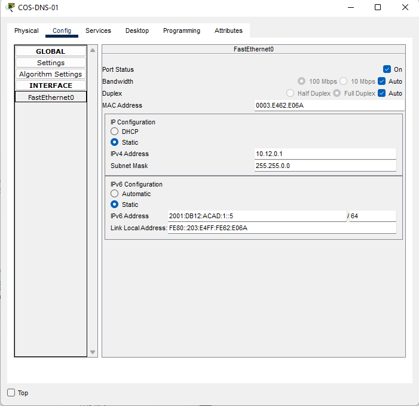

# ROAD TO 94%

## Overzicht adressen

### COS-ROUTER-01

```

COS-ROUTER-01> enable
COS-ROUTER-01# configure terminal

COS-ROUTER-01(config)# interface Serial0/1/0
COS-ROUTER-01(config)# no shutdown
COS-ROUTER-01(config)# ip address 193.191.187.101 255.255.255.252


COS-ROUTER-01(config-if)# interface GigabitEthernet0/0/0.12
COS-ROUTER-01(config-subif)# encapsulation dot1Q 12
COS-ROUTER-01(config-subif)#ip address 10.12.255.254 255.255.0.0
COS-ROUTER-01(config-subif)#ipv6 address 2001:DB12:ACAD:1::1/64
COS-ROUTER-01(config-subif)#ipv6 address FE80::1 link-local

COS-ROUTER-01(config-subif)#interface GigabitEthernet0/0/0.20
COS-ROUTER-01(config-subif)#encapsulation dot1Q 20
COS-ROUTER-01(config-subif)#ip address 10.20.255.254 255.255.0.0
COS-ROUTER-01(config-subif)#ipv6 address 2001:DB20:ACAD:1::1/64
COS-ROUTER-01(config-subif)#ipv6 address FE80::1 link-local

```

### ISP-ROUTER-01

```

ISP-ROUTER-01> enable
ISP-ROUTER-01# configure terminal

ISP-ROUTER-01(config)# interface Serial0/1/0
ISP-ROUTER-01(config-if)# no shutdown
ISP-ROUTER-01(config-if)# ip address 193.191.187.102 255.255.255.252

ISP-ROUTER-01(config)# interface Serial0/1/1
ISP-ROUTER-01(config-if)# no shutdown
ISP-ROUTER-01(config-if)# ip address 84.199.169.34 255.255.255.252

```

### JYN-ROUTER-01

```

JYN-ROUTER-01> enable
JYN-ROUTER-01# configure terminal

JYN-ROUTER-01(config)# interface Serial0/1/0
JYN-ROUTER-01(config-if)# no shutdown
JYN-ROUTER-01(config-if)# ip address 84.199.169.33 255.255.255.252

JYN-ROUTER-01(config)# interface GigabitEthernet0/0/0
JYN-ROUTER-01(config-if)# no shutdown
JYN-ROUTER-01(config-if)# ip address 10.51.1.254 255.255.255.0

JYN-ROUTER-01(config)# interface GigabitEthernet0/0/1
JYN-ROUTER-01(config-if)# no shutdown
JYN-ROUTER-01(config-if)# ip address 10.53.1.254 255.255.255.0

```

### COS-DNS-01 




## VLAN


### COS-ACCS-01

```

COS-ACCS-01> enable
COS-ACCS-01# configure terminal

COS-ACCS-01(config)# vlan 12
COS-ACCS-01(config)# name ServerLAN

COS-ACCS-01(config)# vlan 20
COS-ACCS-01(config)# name PCLAN

COS-ACCS-01(config)# interface range FastEthernet0/1-3
COS-ACCS-01(config-if-range)#switchport mode access
COS-ACCS-01(config-if-range)#switchport access vlan 20

```

### COS-ACCS-02


```

COS-ACCS-02> enable
COS-ACCS-02# configure terminal

COS-ACCS-02(config)# vlan 12
COS-ACCS-02(config)# name ServerLAN

COS-ACCS-02(config)# vlan 20
COS-ACCS-02(config)# name PCLAN

COS-ACCS-02(config)# interface range FastEthernet0/1-3
COS-ACCS-02(config-if-range)#switchport mode access
COS-ACCS-02(config-if-range)#switchport access vlan 20

```

**_AT THIS POINT YOU SHOULD HAVE 40%_**

### COS-CORE-01

```

COS-CORE-01(config)# vlan 12
COS-CORE-01(config-vlan)# name ServerLAN
COS-CORE-01(config-vlan)# exit

COS-CORE-01(config)# vlan 20
COS-CORE-01(config-vlan)# name PCLAN

```

## Port-Channel

### COS-CORE-01

```

COS-CORE-01(config)# interface range FastEthernet0/1-2
COS-CORE-01(config-if-range)# switchport mode trunk
COS-CORE-01(config-if-range)# channel-group 1 mode active

COS-CORE-01(config)# interface range FastEthernet0/3-4
COS-CORE-01(config-if-range)# switchport mode trunk
COS-CORE-01(config-if-range)# channel-group 2 mode active

```

### COS-ACCS-01

```

COS-ACCS-01(config)# interface range FastEthernet0/23-24
COS-ACCS-01(config-if-range)# switchport mode trunk
COS-ACCS-01(config-if-range)# channel-group 1 mode active

COS-ACCS-01(config)# interface range GigabitEthernet0/1-2
COS-ACCS-01(config-if-range)# switchport mode trunk
COS-ACCS-01(config-if-range)# channel-group 2 mode active

```


### COS-ACCS-02

```

COS-ACCS-02(config)# interface range FastEthernet0/23-24
COS-ACCS-02(config-if-range)# switchport mode trunk
COS-ACCS-02(config-if-range)# channel-group 1 mode active

COS-ACCS-02(config)# interface range GigabitEthernet0/1-2
COS-ACCS-02(config-if-range)# switchport mode trunk
COS-ACCS-02(config-if-range)# channel-group 2 mode active

```

**_AT THIS POINT YOU SHOULD HAVE 60%_**


## DHCP

### COS-ROUTER-01

```

COS-ROUTER-01(config)# ip dhcp pool VLAN20_POOL
COS-ROUTER-01(dhcp-config)# domain-name cosci.local
COS-ROUTER-01(dhcp-config)# default-router 10.20.255.254
COS-ROUTER-01(dhcp-config)# network 10.20.0.254 255.255.0.0
COS-ROUTER-01(dhcp-config)# dns-server 10.12.0.1

COS-ROUTER-01(dhcp-config)# ipv6 dhcp pool VLAN20_POOL_IPV6
COS-ROUTER-01(config-dhcpv6)# dns-server 2001:DB12:ACAD:1::5
COS-ROUTER-01(config-dhcpv6)# domain-name cosci.local


COS-ROUTER-01(config-dhcpv6)#int g0/0/0.20
COS-ROUTER-01(config-subif)#ipv6 nd other-config-flag
COS-ROUTER-01(config-subif)#ipv6 dhcp server VLAN20_POOL_IPV6

COS-ROUTER-01(config-subif)# exit
COS-ROUTER-01(config)# ip dhcp excluded-address 10.20.10.0 10.20.255.254

```

**_AT THIS POINT YOU SHOULD HAVE 69%_**
**Noice**

### JYN-ROUTER-01

```

JYN-ROUTER-01(config)# ip dhcp pool LAN_POOL
JYN-ROUTER-01(dhcp-config)# domain-name jynuper.local
JYN-ROUTER-01(dhcp-config)# dns-server 10.12.0.1
JYN-ROUTER-01(dhcp-config)# network 10.51.1.0 255.255.255.0
JYN-ROUTER-01(dhcp-config)#ip dhcp excluded-address 10.51.1.254
JYN-ROUTER-01(dhcp-config)# exit

JYN-ROUTER-01(config)# ip dhcp excluded-address 10.51.1.254

```


## OSPF

### COS-ROUTER-01

```

COS-ROUTER-01(config)# router ospf 10
COS-ROUTER-01(config)# router-id 193.191.187.101
COS-ROUTER-01(config)# network 193.191.187.100 0.0.0.3 area 0
COS-ROUTER-01(config-router)# network 10.12.0.0 0.0.255.255 area 0
COS-ROUTER-01(config-router)# network 10.20.0.0 0.0.255.255 area 0
COS-ROUTER-01(config-router)# passive-interface g0/0/0

```

### ISP-ROUTER-01

```

ISP-ROUTER-01(config)# router ospf 10
ISP-ROUTER-01(config-router)# network 193.191.187.100 0.0.0.3 area 0
ISP-ROUTER-01(config-router)# network 84.199.169.32 0.0.0.3 area 0

```

### JYN-ROUTER-01

```

JYN-ROUTER-01(config)#router ospf 10
JYN-ROUTER-01(config-router)#passive-interface GigabitEthernet0/0/0
JYN-ROUTER-01(config-router)#passive-interface GigabitEthernet0/0/1
JYN-ROUTER-01(config-router)#network 10.51.1.0 0.0.255.255 area 0
JYN-ROUTER-01(config-router)#network 10.53.1.0 0.0.255.255 area 0

```

## Port-Security

### COS-ACCS-01

```

COS-ACCS-01(config)#int range f0/1-3
COS-ACCS-01(config-if-range)#switchport port-security

```

### COS-ACCS-02

```

COS-ACCS-02(config)#int range f0/1-3
COS-ACCS-02(config-if-range)#switchport port-security

```


